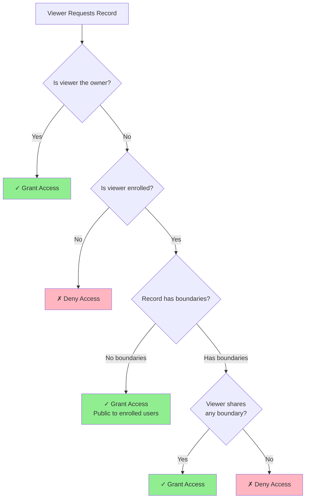

# Stratos - Private Shared Data for ATProtocol

Stratos provides isolated, private data storage within the ATProtocol ecosystem. ATprotocol is designed for data to be in the public to allow for open inter-operability. This however means that there is a lack of privacy on protocol, Stratos solves this while remaining "on protocol" by:

- Storing records and blobs in a dedicated Stratos service (separate from PDS)
- Allowing users to enroll in the service via oauth to store their data
- Accessible only to enrolled users
- Scoped by configurable boundary domains
- Excluded from public/unauthenticated sync/export

## Boundary Behavior

Records stored in Stratos can be scoped to boundary domains. Access is determined during hydration based on whether the authenticated viewer shares boundaries with the record:



## Quick Start

### Local Development

```bash
pnpm install
pnpm build
pnpm test
cd stratos-service
pnpm start
```

### Environment Variables

Create a `.env` file from the example:

```bash
cp .env.example .env
```

Required variables:

- `STRATOS_SERVICE_DID` - Unique identifier for your Stratos instance
- `STRATOS_PUBLIC_URL` - Public URL where the service is accessible
- `STRATOS_ALLOWED_DOMAINS` - Comma-separated boundary domains

### S3 Storage

To use S3-compatible storage instead of local disk:

```bash
# In .env
STRATOS_BLOB_STORAGE=s3
STRATOS_S3_BUCKET=stratos-blobs
STRATOS_S3_REGION=us-east-1
STRATOS_S3_ENDPOINT=https://s3.amazonaws.com
STRATOS_S3_ACCESS_KEY=your-access-key
STRATOS_S3_SECRET_KEY=your-secret-key
```

Or use the included MinIO example (uncomment in docker-compose.yml):

```bash
# In .env
STRATOS_BLOB_STORAGE=s3
STRATOS_S3_BUCKET=stratos-blobs
STRATOS_S3_ENDPOINT=http://minio:9000
STRATOS_S3_ACCESS_KEY=minioadmin
STRATOS_S3_SECRET_KEY=minioadmin
```

## Configuration

The Stratos service is configured via environment variables:

| Variable                        | Description                                       | Default        |
| ------------------------------- | ------------------------------------------------- | -------------- |
| `STRATOS_SERVICE_DID`           | Service DID (e.g., `did:web:stratos.example.com`) | Required       |
| `STRATOS_PORT`                  | HTTP port                                         | `3100`         |
| `STRATOS_PUBLIC_URL`            | Public URL for the service                        | Required       |
| `STRATOS_DATA_DIR`              | Directory for SQLite databases                    | `./data`       |
| `STRATOS_ALLOWED_DOMAINS`       | Comma-separated list of valid boundary domains    | Required       |
| `STRATOS_ENROLLMENT_MODE`       | `open` or `allowlist`                             | `allowlist`    |
| `STRATOS_ALLOWED_DIDS`          | Comma-separated list of allowed DIDs              | `[]`           |
| `STRATOS_ALLOWED_PDS_ENDPOINTS` | Comma-separated list of allowed PDS URLs          | `[]`           |
| `STRATOS_IMPORT_MAX_BYTES`      | Maximum CAR file size for repo import             | `268435456`    |
| `STRATOS_SIGNING_KEY_HEX`       | Service signing key (secp256k1, hex-encoded)      | Auto-generated |

## Enrollment

Users enroll via OAuth authentication. The service validates enrollment based on configuration:

- **Mode: `open`** - Any user can enroll
- **Mode: `allowlist`** - User must be in `allowedDids` OR their PDS must be in
  `allowedPdsEndpoints`

## Packages

### @northskysocial/stratos-core

Core package containing:

- Validation logic for stratos records
- Database schema and migrations
- Storage abstractions (repo, record, blob)
- MST commit builder for ATProto-compatible repos

### @northskysocial/stratos-service

Standalone HTTP service providing:

- OAuth authorization server
- XRPC endpoints for record CRUD
- WebSocket subscription for AppView indexing
- Repository export/import via CAR files
- Signed commits with MST inclusion proofs
