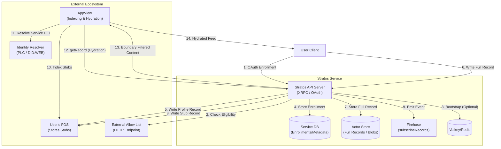
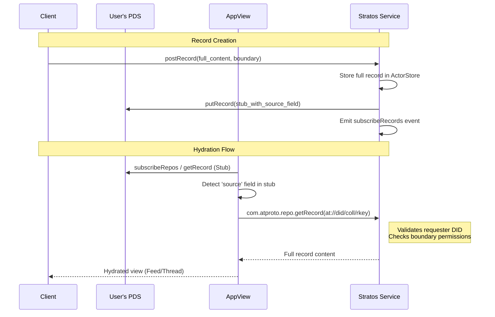
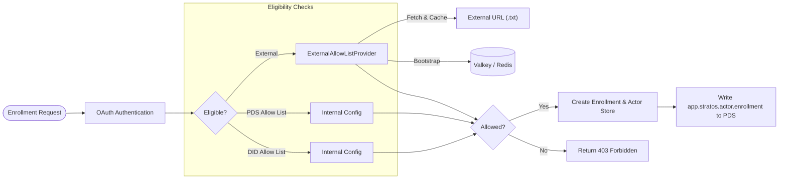

# Stratos Architecture Diagram

This document contains Mermaid diagrams representing the Stratos system architecture, including
enrollment flows, record management, and hydration.

## High-Level System Architecture

This diagram shows the relationship between the Client, AppView, User's PDS, and the Stratos
Service.

## Record Hydration Flow (Sequence)

This sequence diagram details the "Source Field Pattern" used for content hydration while
maintaining data boundaries.

## Enrollment & AllowList Mechanism

How the service manages user eligibility using both internal and external sources.

