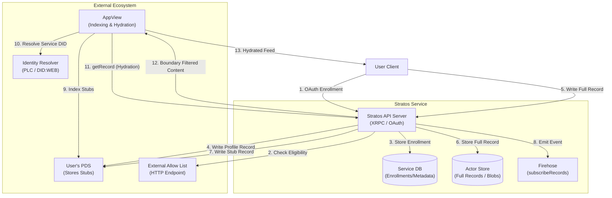
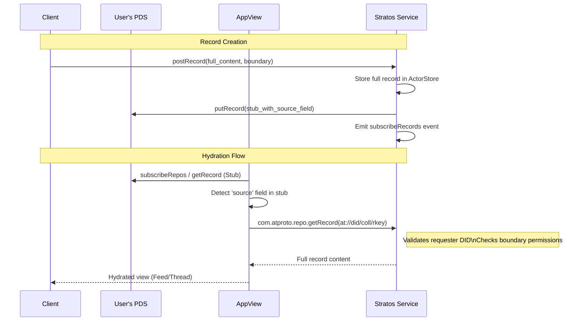
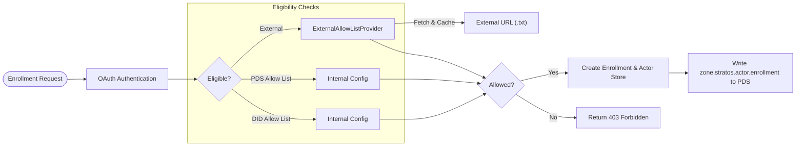
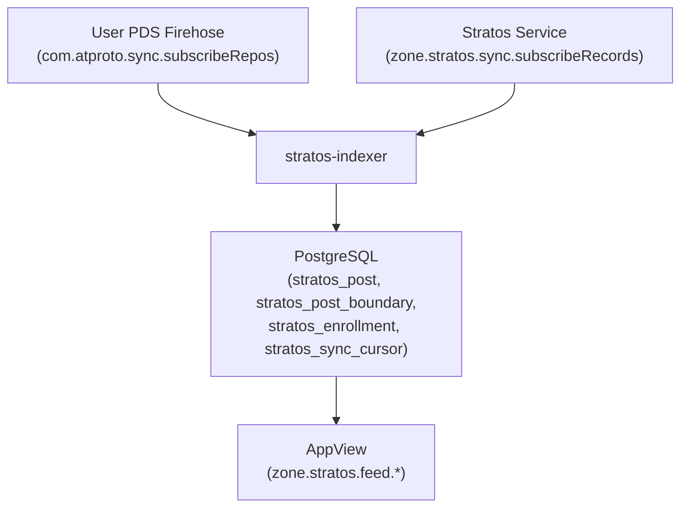

# System Diagrams

High-level architecture and flow diagrams for Stratos.

## System Architecture

## Record Hydration Sequence

## Enrollment & Allowlist Mechanism

## Indexer Sync Architecture

