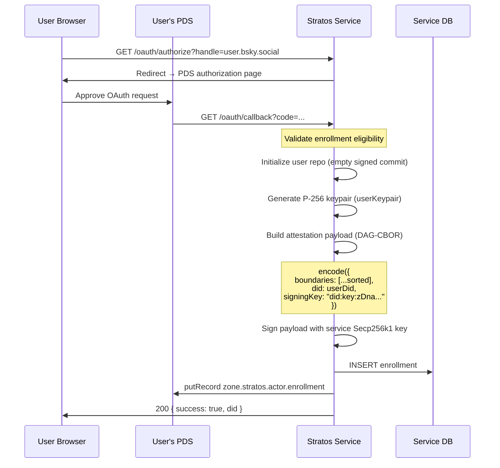
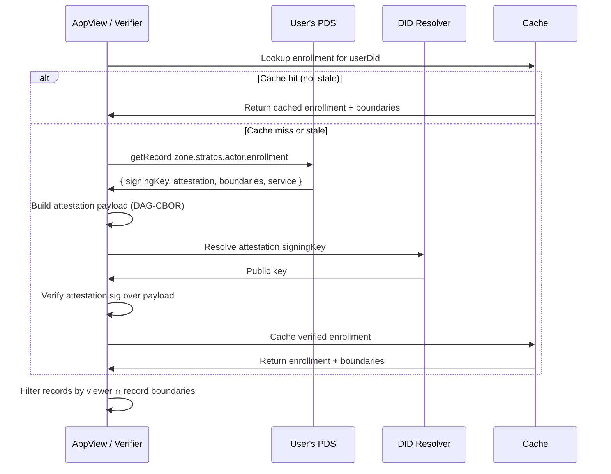
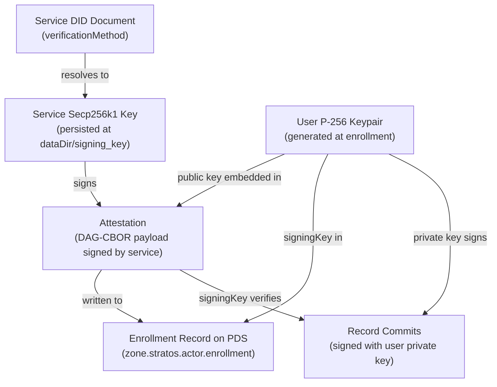
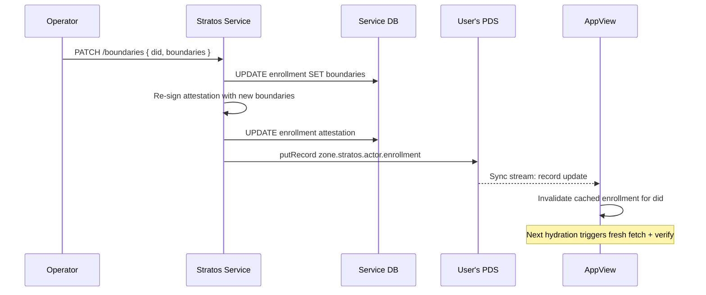

# Enrollment Signing

During enrollment, Stratos establishes a cryptographic trust chain that lets AppViews verify user identity and boundary membership without querying the live service.

## What Gets Signed

At enrollment time Stratos generates:

- A **per-user P-256 keypair** — private key stored on the service, public key embedded in the enrollment record.
- A **service attestation** — a DAG-CBOR signature binding the user's DID, boundaries, and signing key together.

The attestation payload is:

```typescript
{
  boundaries: ['engineering', 'leadership'],  // sorted
  did: 'did:plc:alice',
  signingKey: 'did:key:zDna...'              // user's P-256 public key
}
```

Payload is serialised as DAG-CBOR (not JSON) and signed with the service's Secp256k1 key.

## Enrollment Record Shape

```json
{
  "service": "https://stratos.example.com",
  "boundaries": [{ "value": "engineering" }, { "value": "leadership" }],
  "signingKey": "did:key:zDna...",
  "attestation": {
    "sig": { "$bytes": "..." },
    "signingKey": "did:key:zQ3s..."
  },
  "createdAt": "2026-03-12T00:00:00.000Z"
}
```

One record is written per Stratos service, keyed at the service DID as the rkey.

## Enrollment Flow



## Verification Flow



**Verification steps:**

1. Read `zone.stratos.actor.enrollment` record from user's PDS.
2. Build the attestation payload from `{ did, sorted(boundaries), signingKey }`.
3. Resolve the service public key from `attestation.signingKey` or service DID document.
4. Verify `attestation.sig` bytes over the DAG-CBOR payload.
5. Confirm the record is for the expected user and service.

```typescript
import { encode as cborEncode } from '@atcute/cbor'

function buildAttestationPayload(options: {
  did: string
  boundaries: Array<{ value: string }>
  signingKey: string
}) {
  return cborEncode({
    boundaries: options.boundaries.map((entry) => entry.value).sort(),
    did: options.did,
    signingKey: options.signingKey,
  })
}
```

## Trust Model



A verifier can chain trust: enrollment record → verify service attestation → extract user `signingKey` → verify commit signature. This proves both service endorsement and user authorship.

## What the Attestation Does Not Prove

- That the user is **currently enrolled** (boundaries may have changed since the record was written).
- That the **boundaries haven't changed** after the record was written.

For freshness guarantees, query the live status endpoint:

```bash
GET /xrpc/zone.stratos.enrollment.status?did=<did>
```

Authenticated callers receive current boundaries, signing key, and a fresh attestation.

## Boundary Changes

When a user's boundaries change, the service re-signs a new attestation and rewrites the PDS record. AppViews learn of the change via the sync stream and must invalidate their cache.


