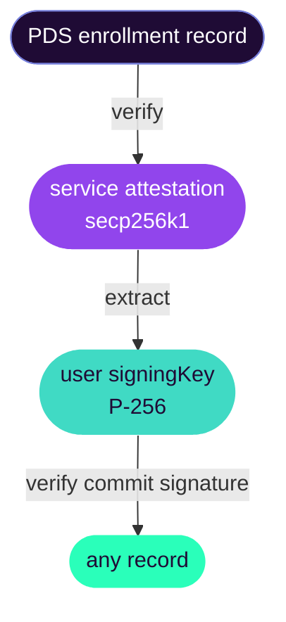

# Attestation Verification

## Overview

Each enrolled user's enrollment record includes a **service attestation** — a DAG-CBOR payload signed by the Stratos service's secp256k1 key. This enables AppViews to verify a user's enrollment and boundaries offline without querying the enrollment status endpoint on every request.

## Enrollment Record Fields

The `zone.stratos.actor.enrollment` record on the user's PDS includes:

| Field         | Type             | Description |
|---------------|------------------|-------------|
| `service`     | string           | Stratos service endpoint URL |
| `boundaries`  | `Domain[]`       | User's boundary assignments |
| `signingKey`  | string (did:key) | User's P-256 public key |
| `attestation` | object           | Service attestation of enrollment |
| `createdAt`   | string           | ISO 8601 enrollment timestamp |

The `attestation` object:

| Field        | Type             | Description |
|--------------|------------------|-------------|
| `sig`        | bytes            | secp256k1 signature over the CBOR payload |
| `signingKey` | string (did:key) | Service public key that created the signature |

## Verifying an Attestation

Reconstruct the CBOR payload and check the signature:

```typescript
import { encode as cborEncode } from '@atcute/cbor'
import { verifySignature } from '@atproto/crypto'

async function verifyAttestation(
  enrollmentRecord: {
    signingKey: string
    attestation: { sig: Uint8Array; signingKey: string }
    boundaries: Array<{ value: string }>
  },
  userDid: string,
): Promise<boolean> {
  const sortedBoundaries = enrollmentRecord.boundaries
    .map((b) => b.value)
    .sort()

  const payload = cborEncode({
    boundaries: sortedBoundaries,
    did: userDid,
    signingKey: enrollmentRecord.signingKey,
  })

  return verifySignature(
    enrollmentRecord.attestation.signingKey,
    payload,
    enrollmentRecord.attestation.sig,
  )
}
```

::: warning Boundary sort order matters
The attestation payload encodes boundaries as a **sorted** array. Reconstruct with `.sort()` or verification will fail.
:::

## Trust Model

The attestation proves the Stratos service vouched for the user's enrollment and boundaries **at signing time**. It does not prove:

- The user is still enrolled right now.
- The boundaries haven't changed since signing.

For high-stakes operations, also call the live status endpoint:

```
GET /xrpc/zone.stratos.enrollment.status?did=<did>
```

Authenticated callers receive boundaries, signing key, enrollment rkey, and a fresh attestation.

## Chained Verification

Because record commits are signed with the user's P-256 key, a verifier can chain trust:



This proves both service endorsement of the enrollment and user authorship of each record.
