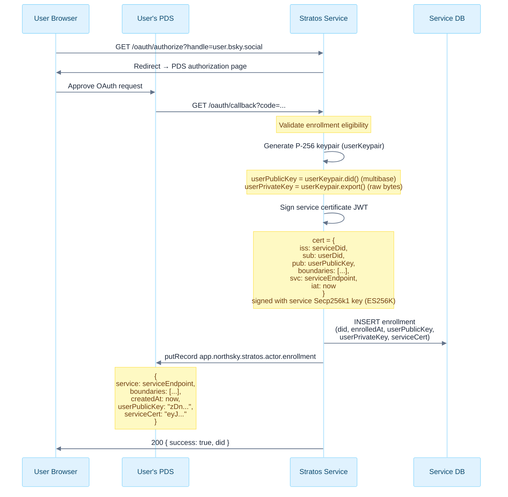
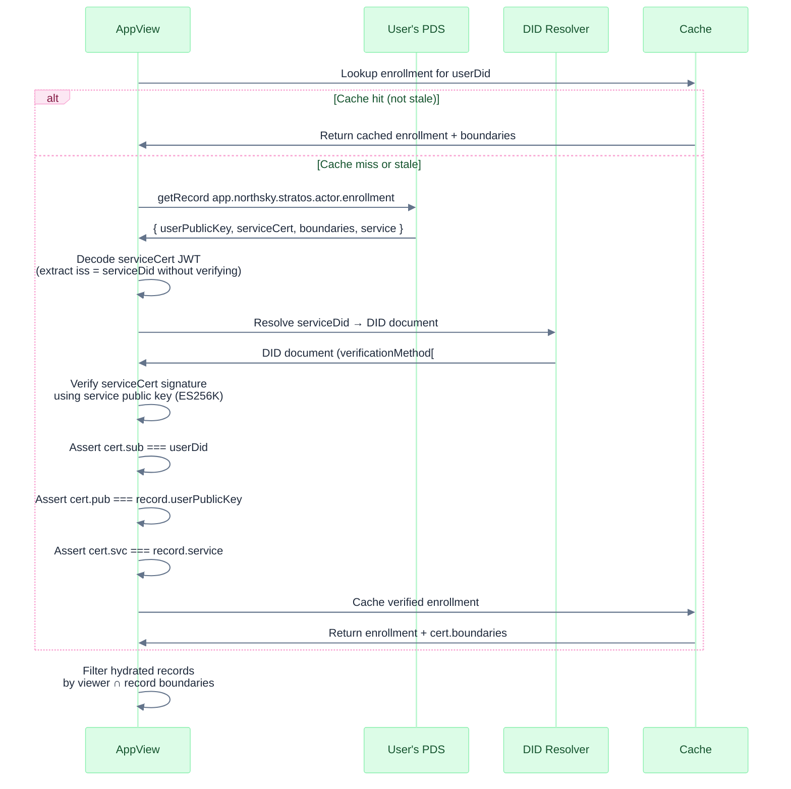
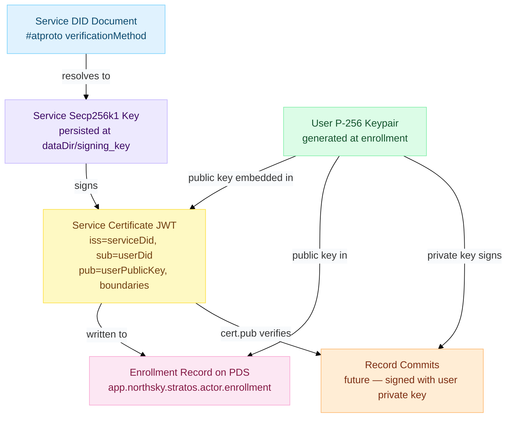
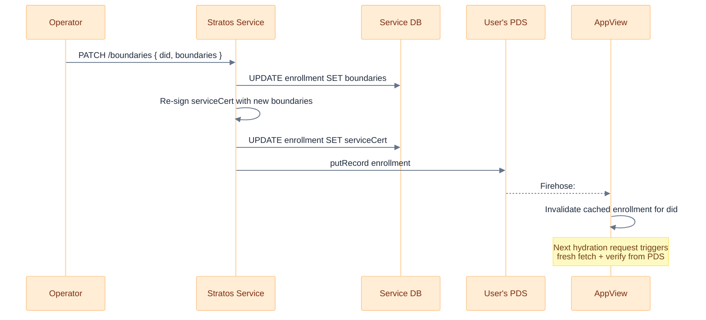

# Enrollment Signing & Verification

## Key Generation on Enrollment

## Verification Flow (AppView — no Stratos call)

## Trust Chain

## Boundary Update Flow

When a user's boundaries change, the service re-signs a new certificate and rewrites the PDS record. AppViews learn of the change via the firehose subscription and invalidate their cache.

