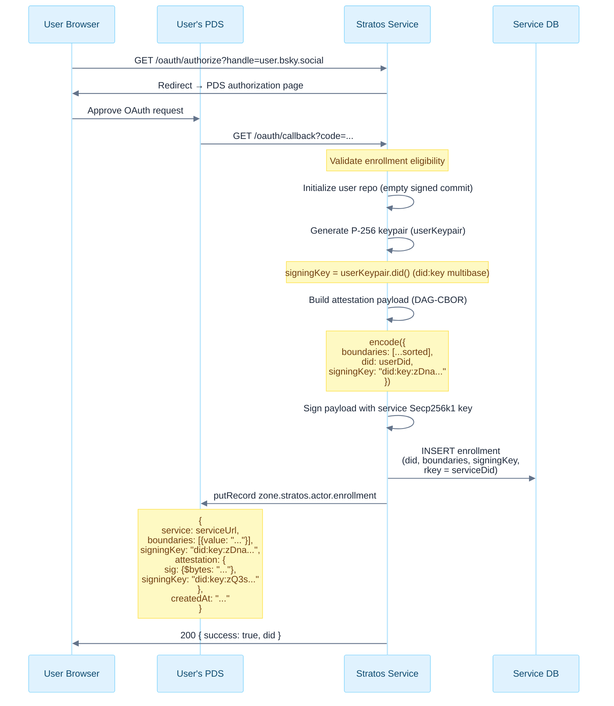
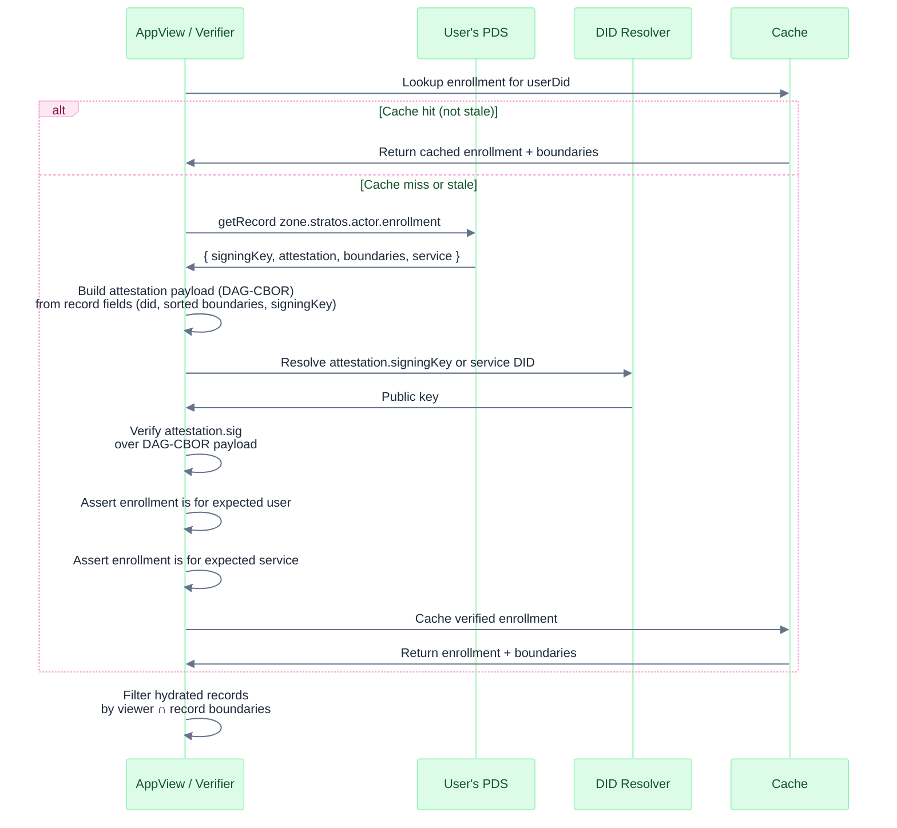
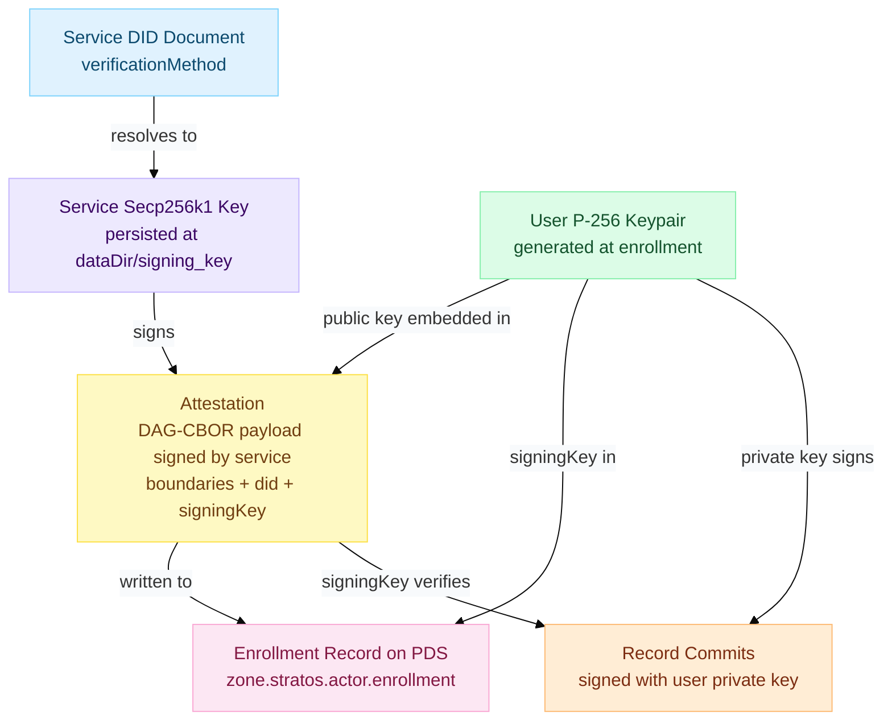
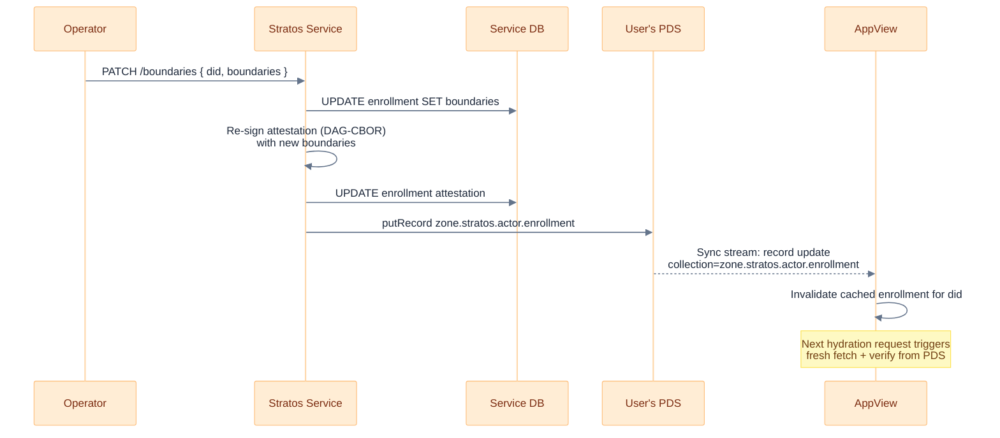

# Enrollment Signing and Verification

This document describes the enrollment attestation model implemented in the current Stratos codebase.

## Summary

During enrollment, Stratos creates and persists two pieces of signing state:

- a service signing key, used to sign repo commits and enrollment attestations
- a per-user signing key, stored as a `did:key` and included in the enrollment record

The enrollment record published to the user's PDS contains:

- the Stratos service URL
- the user's boundary memberships for that service
- the user's signing key DID
- a service attestation over the user's DID, sorted boundaries, and signing key

## Enrollment Record Shape

The current `zone.stratos.actor.enrollment` record shape is:

```json
{
  "service": "https://stratos.example.com",
  "boundaries": [{ "value": "engineering" }, { "value": "leadership" }],
  "signingKey": "did:key:zDna...",
  "attestation": {
    "sig": { "$bytes": "..." },
    "signingKey": "did:key:zQ3s..."
  },
  "createdAt": "2026-03-12T00:00:00.000Z"
}
```

Each Stratos service writes its own record using the service DID as the rkey.

## What the Service Signs

The attestation payload is DAG-CBOR over this object:

```ts
{
  boundaries: ['engineering', 'leadership'],
  did: 'did:plc:alice',
  signingKey: 'did:key:zDna...'
}
```

Important details:

- boundary strings are sorted before signing
- the payload is binary DAG-CBOR, not JSON text
- the signature is produced by the Stratos service signing key

## Enrollment Flow



## Verification Flow



A verifier should:

1. Read the user's `zone.stratos.actor.enrollment` record from the PDS.
2. Build the attestation payload from the record fields.
3. Resolve the service public key from `attestation.signingKey` or the service DID document.
4. Verify the signature bytes in `attestation.sig`.
5. Confirm the record is for the expected user and service.

## Verification Example

```ts
import { encode as cborEncode } from '@atcute/cbor'

function buildAttestationPayload(options: {
  did: string
  boundaries: Array<{ value: string }>
  signingKey: string
}) {
  return cborEncode({
    boundaries: options.boundaries.map((entry) => entry.value).sort(),
    did: options.did,
    signingKey: options.signingKey,
  })
}
```

After building the payload, verify `attestation.sig` using the service public key.

## Trust Model



This attestation lets a client or AppView verify that:

- the enrollment record was vouched for by the Stratos service
- the boundary set has not been modified after signing
- the user signing key in the record matches what the service enrolled

What it does not prove by itself:

- that the user is still enrolled right now
- that the boundaries have not changed since the record was last written

For that, query the live status endpoint.

## Live Freshness Check

`GET /xrpc/zone.stratos.enrollment.status?did=<did>` is the live service check.

Behavior today:

- unauthenticated callers receive `enrolled: true` or `false`
- authenticated callers also receive boundaries, signing key, enrollment rkey, and a fresh attestation

Use this when you need stronger freshness guarantees than the cached PDS record provides.

## Boundary Changes

When a user's boundaries change, the Stratos service re-signs a new attestation and rewrites the PDS record. AppViews learn of the change via the sync stream and invalidate their cache.



## Legacy Notes

Older docs described a JWT-shaped service certificate and `app.northsky.stratos.actor.enrollment` records keyed at `self`. That is not the current model in this repository.

The current model uses:

- `zone.stratos.actor.enrollment`
- one record per Stratos service
- service-DID rkeys for new enrollments
- DAG-CBOR payload signing for the attestation
