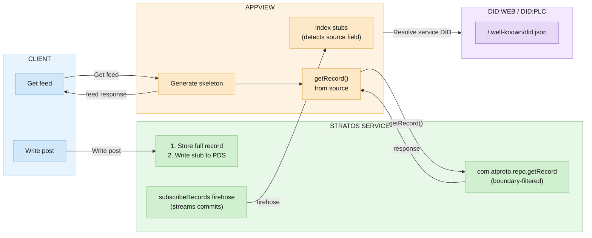
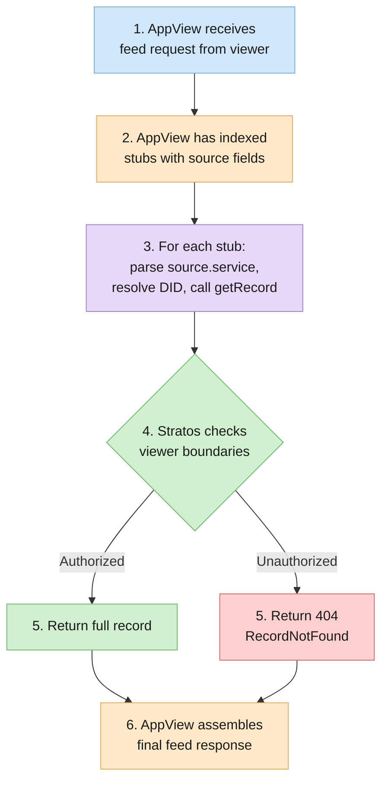

# Stratos Hydration Architecture

## Overview

This document describes the Stratos architecture using the **source field pattern** for hydration. This approach:

- Writes **stub records** to user's PDS with a `source` field pointing to the Stratos service
- Full records are stored in Stratos with boundary restrictions
- AppViews hydrate via standard `com.atproto.repo.getRecord` calls to the service in `source.service`
- Uses `zone.stratos.actor.enrollment` records for endpoint discovery
- Follows feature-sliced architecture with ports/adapters pattern

---

## Source Field Pattern

The source field enables self-describing hydration. When a user creates a record in Stratos:

1. **Full record** is stored in Stratos (with boundary, content, etc.)
2. **Stub record** is written to user's PDS with `source` field

### Source Field Structure

```typescript
interface RecordSource {
  vary: 'authenticated' | 'unauthenticated' // How hydration varies
  subject: {
    uri: string // at:// URI of the full record
    cid: string // CID of the full record content
  }
  service: string // DID with fragment, e.g., "did:web:stratos.example.com#atproto_pns"
}
```

### Example Records

**Full record (in Stratos)**:

```json
{
  "$type": "zone.stratos.feed.post",
  "text": "Private message for my community",
  "boundary": {
    "values": [{ "value": "fanart" }]
  },
  "createdAt": "2024-01-15T12:00:00.000Z"
}
```

**Stub record (on user's PDS)**:

```json
{
  "$type": "zone.stratos.feed.post",
  "source": {
    "vary": "authenticated",
    "subject": {
      "uri": "at://did:plc:abc/zone.stratos.feed.post/tid123",
      "cid": "bafyreibeef..."
    },
    "service": "did:web:stratos.example.com#atproto_pns"
  },
  "createdAt": "2024-01-15T12:00:00.000Z"
}
```

---

## Architecture



---

## Endpoint Discovery via Profile Record

Instead of modifying user DID documents (requires PLC signing), users publish an enrollment record to their PDS during OAuth enrollment:

### Lexicon: zone.stratos.actor.enrollment

```json
{
  "lexicon": 1,
  "id": "zone.stratos.actor.enrollment",
  "defs": {
    "main": {
      "type": "record",
      "key": "self",
      "description": "Declaration of Stratos service enrollments",
      "record": {
        "type": "object",
        "required": ["services", "createdAt"],
        "properties": {
          "services": {
            "type": "array",
            "description": "List of Stratos service enrollments",
            "items": { "type": "ref", "ref": "#serviceEnrollment" },
            "maxLength": 10
          },
          "createdAt": { "type": "string", "format": "datetime" }
        }
      }
    },
    "serviceEnrollment": {
      "type": "object",
      "required": ["endpoint"],
      "properties": {
        "endpoint": {
          "type": "string",
          "format": "uri",
          "description": "Stratos service endpoint URL"
        },
        "boundaries": {
          "type": "array",
          "description": "Boundaries available on this service",
          "items": { "type": "string" },
          "maxLength": 50
        },
        "enrolledAt": { "type": "string", "format": "datetime" }
      }
    }
  }
}
```

### Discovery Flow

```typescript
async function resolveStratosEndpoint(did: string): Promise<string | null> {
  // Resolve DID to find PDS
  const didDoc = await resolveDid(did)
  const pdsEndpoint = didDoc.service.find(
    (s) => s.id === '#atproto_pds',
  )?.serviceEndpoint

  // Fetch enrollment record from user's PDS
  const enrollment = await fetch(
    `${pdsEndpoint}/xrpc/com.atproto.repo.getRecord?` +
      `repo=${did}&collection=zone.stratos.actor.enrollment&rkey=self`,
  )

  if (!enrollment.ok) return null

  const { value } = await enrollment.json()
  return value.services[0]?.endpoint ?? null
}
```

---

## Hydration Model

### Principle

AppViews use the source field to determine hydration:

1. Index stub records from PDS firehose (via `zone.stratos.sync.subscribeRecords`)
2. Detect `source` field → record needs hydration
3. Resolve `source.service` DID to get service endpoint
4. Call standard `com.atproto.repo.getRecord` at service endpoint
5. Stratos returns full content if viewer has boundary access

### Hydration via com.atproto.repo.getRecord

AppViews hydrate using the standard ATProto `getRecord` endpoint:

```http
GET /xrpc/com.atproto.repo.getRecord
  ?repo=did:plc:alice
  &collection=zone.stratos.feed.post
  &rkey=abc123

Authorization: Bearer <service-auth-jwt>
X-Stratos-Viewer: did:plc:viewer
```

**Response (authorized viewer)**:

```json
{
  "uri": "at://did:plc:alice/zone.stratos.feed.post/abc123",
  "cid": "bafyreibeef...",
  "value": {
    "$type": "zone.stratos.feed.post",
    "text": "Full private content",
    "boundary": {
      "values": [{ "value": "fanart" }]
    },
    "createdAt": "2024-01-15T12:00:00.000Z"
  }
}
```

**Response (unauthorized viewer)**:

```json
{
  "error": "RecordNotFound",
  "message": "Record not found or not authorized"
}
```

### Hydration Request Flow



1. AppView receives feed request from viewer (did:plc:viewer)

2. AppView has indexed stubs with source fields

3. For each stub with source field:
   a. Parse source.service → "did:web:stratos.example.com#atproto_pns"
   b. Resolve DID to get service endpoint
   c. Call getRecord at that endpoint:

   GET https://stratos.example.com/xrpc/com.atproto.repo.getRecord
   ?repo=did:plc:alice
   &collection=zone.stratos.feed.post
   &rkey=abc123
   Authorization: Bearer <service-jwt>
   X-Stratos-Viewer: did:plc:viewer

4. Stratos checks viewer's boundaries:
   - Is viewer enrolled in this service?
   - What boundaries does viewer have access to?
   - Do record boundaries overlap with viewer boundaries?

5. If authorized, Stratos returns full record
   If unauthorized, returns 404/RecordNotFound

6. AppView assembles final feed response with hydrated content

---

## Trust Model

### Viewer Boundary Derivation

Stratos service determines viewer's boundaries via:

1. **Enrollment check**: Is viewer enrolled in this service?
2. **Write history**: Boundaries viewer has successfully written with
3. **Membership records**: Explicit `zone.stratos.boundary.member` records
4. **Service config**: Admin-assigned boundary permissions

```typescript
async function getViewerBoundaries(viewerDid: string): Promise<string[]> {
  // Check enrollment
  const enrollment = await enrollmentStore.getEnrollment(viewerDid)
  if (!enrollment) return []

  // Get boundaries from successful writes
  const writtenBoundaries = await db
    .selectDistinct({ boundary: stratosRecord.boundary })
    .from(stratosRecord)
    .where(eq(stratosRecord.authorDid, viewerDid))

  // Get explicit memberships
  const memberships = await db
    .select({ boundary: boundaryMember.boundary })
    .from(boundaryMember)
    .where(eq(boundaryMember.did, viewerDid))

  return [
    ...new Set([
      ...writtenBoundaries.map((b) => b.boundary),
      ...memberships.map((m) => m.boundary),
    ]),
  ]
}
```

### Boundary Authorization

```typescript
function isAuthorized(
  recordBoundaries: string[],
  viewerBoundaries: string[],
): boolean {
  // Viewer must have at least one overlapping boundary
  return recordBoundaries.some((b) => viewerBoundaries.includes(b))
}
```

---

## OAuth Enrollment with Profile Record

### Flow

```
┌─────────────────────────────────────────────────────────────────────────────┐
│                    ENROLLMENT WITH PROFILE RECORD                           │
└─────────────────────────────────────────────────────────────────────────────┘

1. User initiates enrollment at Stratos service
   GET https://stratos.community.example.com/oauth/authorize?handle=alice.bsky.social

2. Stratos redirects to user's PDS OAuth
   - Requests scopes: atproto, repo:zone.stratos.actor.enrollment, repo:zone.stratos.feed.post
   - These allow writing enrollment and stub records to the user's PDS

3. User authorizes on PDS

4. PDS redirects back with auth code
   GET https://stratos.community.example.com/oauth/callback?code=...

5. Stratos exchanges code for tokens

6. Stratos writes enrollment record to user's PDS:

   POST https://bsky.social/xrpc/com.atproto.repo.putRecord
   Authorization: Bearer <user-access-token>
   {
     "repo": "did:plc:alice",
     "collection": "zone.stratos.actor.enrollment",
     "rkey": "self",
     "record": {
       "$type": "zone.stratos.actor.enrollment",
       "services": [{
         "endpoint": "https://stratos.community.example.com",
         "boundaries": ["fanart", "cosplay"],
         "enrolledAt": "2026-02-06T12:00:00Z"
       }],
       "createdAt": "2026-02-06T12:00:00Z"
     }
   }

7. Stratos stores enrollment locally
   - Creates per-user SQLite database
   - Records OAuth session

8. User is now enrolled and discoverable
```

### DPoP Authentication

After enrollment, clients authenticate using DPoP (Demonstration of Proof-of-Possession) tokens:

```
┌─────────────────────────────────────────────────────────────────────────────┐
│                         DPOP AUTHENTICATION FLOW                            │
└─────────────────────────────────────────────────────────────────────────────┘

1. Client generates DPoP proof (JWT signed with ephemeral key)
   - Contains: method, URL, access token hash (ath), nonce if required

2. Client sends request to Stratos:
   Authorization: DPoP <access-token>
   DPoP: <dpop-proof-jwt>

3. Stratos validates DPoP proof structure via DpopManager

4. Stratos extracts issuer (PDS URL) from access token

5. Stratos fetches PDS OAuth metadata:
   GET https://user-pds.example.com/.well-known/oauth-authorization-server

   Response includes:
   {
     "issuer": "https://user-pds.example.com",
     "jwks_uri": "https://user-pds.example.com/oauth/jwks",
     ...
   }

6. Stratos fetches and caches JWKS:
   GET https://user-pds.example.com/oauth/jwks

   Response includes public signing keys

7. Stratos verifies access token:
   - JWT signature verified against JWKS
   - Claims validated (issuer, expiration, audience)
   - Token contains: sub (user DID), scope, cnf.jkt (key thumbprint)

8. Stratos verifies DPoP key binding:
   - DPoP proof public key thumbprint must match token's cnf.jkt

9. Request proceeds with authenticated user DID
```

Note: ATProtocol PDSes do not expose a token introspection endpoint (RFC 7662).
Resource servers verify tokens by fetching the PDS's JWKS and validating signatures locally.

---

## Project Structure (Feature-Sliced)

```
stratos/
├── stratos-core/                    # Domain logic (ports)
│   ├── src/
│   │   ├── index.ts
│   │   ├── shared/                  # Cross-cutting concerns
│   │   │   ├── types.ts             # Core interfaces
│   │   │   ├── errors.ts            # Domain errors
│   │   │   └── utils.ts
│   │   ├── enrollment/              # Feature: Enrollment
│   │   │   ├── index.ts
│   │   │   ├── port.ts              # EnrollmentService interface
│   │   │   ├── domain.ts            # Business logic
│   │   │   └── types.ts
│   │   ├── stub/                    # Feature: Stub record generation
│   │   │   ├── index.ts
│   │   │   ├── port.ts              # StubWriterService interface
│   │   │   ├── domain.ts            # generateStub, isStubRecord
│   │   │   └── types.ts             # RecordSource, StubRecord
│   │   ├── record/                  # Feature: Record CRUD
│   │   │   ├── index.ts
│   │   │   ├── reader.ts
│   │   │   ├── transactor.ts
│   │   │   └── types.ts
│   │   ├── repo/                    # Feature: Repository (MST)
│   │   ├── blob/                    # Feature: Blob storage
│   │   ├── validation/              # Feature: Stratos validation
│   │   └── db/                      # Database layer
│   └── tests/
│       ├── enrollment.test.ts
│       ├── stub.test.ts
│       ├── record.test.ts
│       └── ...
│
├── stratos-service/                 # HTTP service (adapters)
│   ├── src/
│   │   ├── index.ts                 # Entry point
│   │   ├── config.ts                # Includes serviceFragment config
│   │   ├── context.ts               # DI container
│   │   ├── shared/
│   │   │   ├── auth/                # Auth middleware
│   │   │   │   ├── verifier.ts
│   │   │   │   └── service-auth.ts
│   │   │   └── middleware/
│   │   ├── features/
│   │   │   ├── enrollment/          # Feature: Enrollment
│   │   │   │   ├── index.ts
│   │   │   │   ├── adapter.ts       # PDS client for profile record
│   │   │   │   ├── handler.ts       # OAuth routes
│   │   │   │   └── store.ts         # Enrollment persistence
│   │   │   ├── stub/                # Feature: Stub writing
│   │   │   │   ├── index.ts
│   │   │   │   └── adapter.ts       # StubWriterServiceImpl
│   │   │   ├── records/             # Feature: Record API
│   │   │   │   ├── index.ts
│   │   │   │   ├── handlers.ts      # createRecord, getRecord, etc.
│   │   │   │   └── records.ts       # Dual-write logic
│   │   │   └── subscription/        # Feature: Sync
│   │   │       ├── index.ts
│   │   ├── blobstore/               # Blob storage adapters
│   │   │   ├── disk.ts
│   │   │   └── s3.ts
│   │   └── db/                      # Service-wide database
│   └── tests/
│       ├── enrollment.integration.test.ts
│       ├── stub.integration.test.ts
│       ├── records.integration.test.ts
│       └── api.test.ts
│
├── lexicons/
│   └── app/
│       └── stratos/
│           ├── actor/
│           │   └── enrollment.json
│           ├── boundary/
│           │   └── defs.json
│           ├── feed/
│           │   └── post.json        # With source field support
│           ├── defs.json            # Source field types
│           └── sync/
│               └── subscribeRecords.json
│
├── docs/
│   ├── hydration-architecture.md    # This document
│   ├── client-guide.md
│   └── operator-guide.md
│
└── .github/
    └── copilot-instructions.md
```

---

## API Reference

### Enrollment

| Endpoint                           | Method    | Auth | Description               |
| ---------------------------------- | --------- | ---- | ------------------------- |
| `/oauth/authorize`                 | GET       | None | Initiate OAuth enrollment |
| `/oauth/callback`                  | GET       | None | OAuth callback handler    |
| `zone.stratos.enrollment.status`   | Query     | User | Check enrollment status   |
| `zone.stratos.enrollment.unenroll` | Procedure | User | Remove enrollment         |

### Records

| Endpoint                        | Method    | Auth         | Description                                  |
| ------------------------------- | --------- | ------------ | -------------------------------------------- |
| `com.atproto.repo.createRecord` | Procedure | User         | Create record (writes stub to PDS)           |
| `com.atproto.repo.getRecord`    | Query     | User/Service | Get record (boundary-aware for service auth) |
| `com.atproto.repo.listRecords`  | Query     | User/Service | List records                                 |
| `com.atproto.repo.deleteRecord` | Procedure | User         | Delete record (deletes stub from PDS)        |

### Hydration

| Endpoint                           | Method    | Auth         | Description                                   |
| ---------------------------------- | --------- | ------------ | --------------------------------------------- |
| `zone.stratos.repo.hydrateRecord`  | Query     | User/Service | Hydrate single record with boundary filtering |
| `zone.stratos.repo.hydrateRecords` | Procedure | User/Service | Batch hydrate up to 100 records               |

### Sync & Repository

| Endpoint                             | Method       | Auth         | Description                                                          |
| ------------------------------------ | ------------ | ------------ | -------------------------------------------------------------------- |
| `zone.stratos.sync.subscribeRecords` | Subscription | Service      | WebSocket firehose                                                   |
| `com.atproto.sync.getRecord`         | Query        | User/Service | Record CAR with signed commit + MST inclusion proof + record block   |
| `zone.stratos.sync.getRepo`          | Query        | User/Service | Export full repository as CAR (all blocks, MST nodes, signed commit) |
| `zone.stratos.repo.importRepo`       | Procedure    | User         | Import repository from CAR with CID integrity verification           |

---

## Configuration

### Environment Variables

| Variable                     | Required | Default       | Description                                              |
| ---------------------------- | -------- | ------------- | -------------------------------------------------------- |
| `STRATOS_PORT`               | No       | `3100`        | HTTP server port                                         |
| `STRATOS_PUBLIC_URL`         | Yes      | -             | Public URL for OAuth callbacks                           |
| `STRATOS_DID`                | Yes      | -             | Service DID                                              |
| `STRATOS_SERVICE_FRAGMENT`   | No       | `atproto_pns` | Service fragment for source field                        |
| `STRATOS_SIGNING_KEY`        | Yes      | -             | Service signing key (secp256k1)                          |
| `STRATOS_ALLOWED_BOUNDARIES` | No       | `[]`          | Valid boundary values                                    |
| `STRATOS_ALLOWED_APPVIEWS`   | No       | `[]`          | AppView DIDs allowed to call getRecord with service auth |
| `STRATOS_IMPORT_MAX_BYTES`   | No       | `268435456`   | Maximum CAR file size for importRepo (256 MiB)           |
| `STRATOS_DATA_DIR`           | No       | `./data`      | Per-actor SQLite storage                                 |
| `STRATOS_BLOB_STORAGE`       | No       | `local`       | `local` or `s3`                                          |

### Service DID Configuration

The service fragment (`STRATOS_SERVICE_FRAGMENT`) is appended to the service DID for the `source.service` field:

```
DID: did:web:stratos.example.com
Fragment: atproto_pns
Result: did:web:stratos.example.com#atproto_pns
```

This allows the DID document to specify multiple service types:

Stratos service needs a DID for inter-service authentication:

```bash
# Generate service keypair
openssl ecparam -name secp256k1 -genkey -noout -out stratos-key.pem
openssl ec -in stratos-key.pem -pubout -out stratos-key.pub.pem

# Create did:web for service
# DID: did:web:stratos.community.example.com
# Host /.well-known/did.json with service verification methods
```

---

## Security Considerations

| Concern                   | Mitigation                                                  |
| ------------------------- | ----------------------------------------------------------- |
| Boundary spoofing         | Stratos validates boundaries at write time                  |
| Unauthorized hydration    | AppView allowlist, inter-service JWT verification           |
| Profile record tampering  | User controls their PDS, signed commits                     |
| Data leakage              | Hydration respects boundaries, no full data in subscription |
| Cross-service correlation | Boundaries are service-local by default                     |

---

## References

- [ATProtocol Record Hydration (blog post)](https://blog.smokesignal.events/posts/3lvehxge7oo2a-atprotocol-record-hydration-building-privacy-aware-views)
- [Stratos Service Design (previous)](../atproto/packages/pds/docs/stratos-service-design.md)
- [ATProto OAuth Specification](https://atproto.com/specs/oauth)
