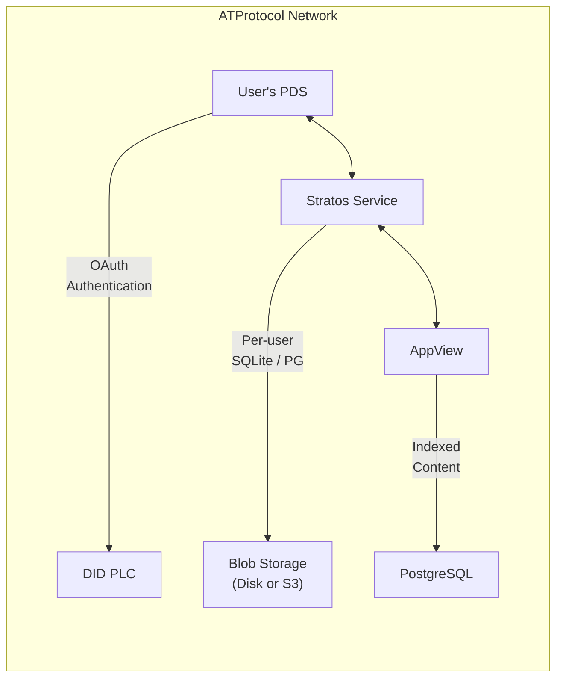
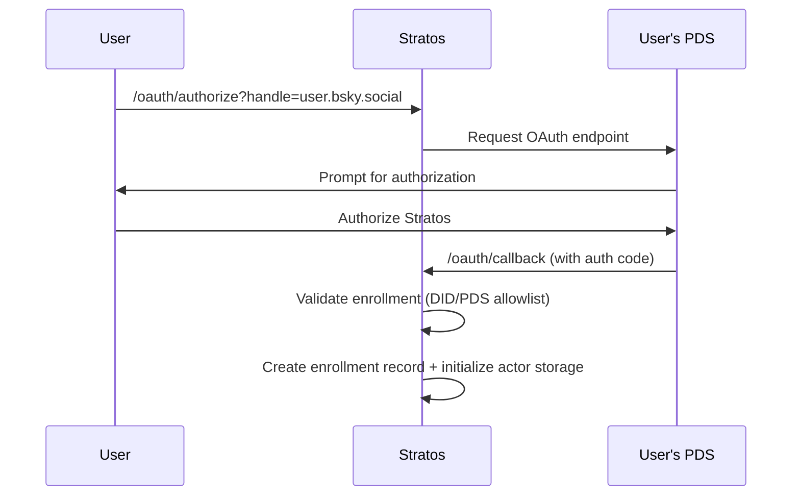
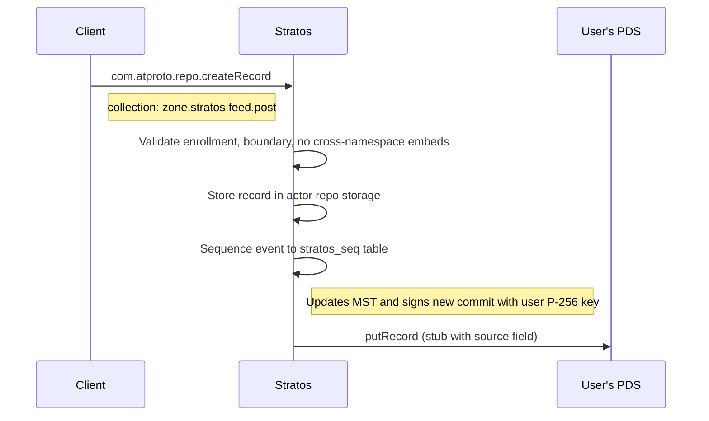
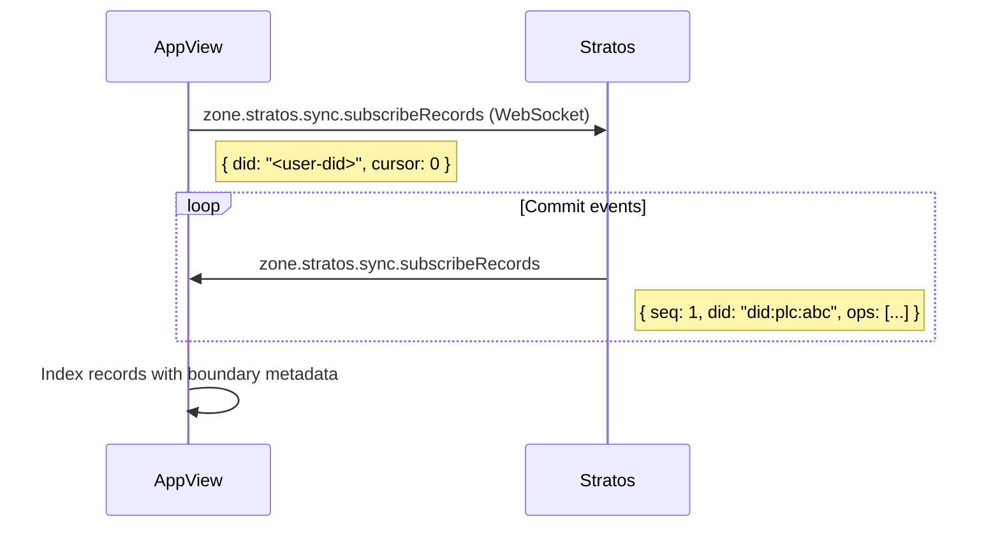
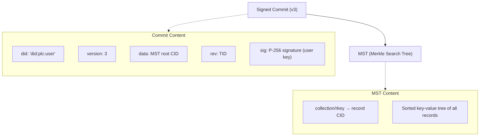

# Architecture

## System Components



## Data Flow

### User Enrollment



### Record Creation



### AppView Indexing



## Repository & MST Architecture

Stratos maintains a per-user **Merkle Search Tree (MST)** and **signed commit chain** compatible with the ATProto repo format. Every record write produces a signed commit that updates the MST root, enabling cryptographic verification of repository contents.



| Endpoint | Description |
|----------|-------------|
| `com.atproto.sync.getRecord` | CAR with signed commit + MST inclusion proof + record block |
| `zone.stratos.sync.getRepo` | Full repo as a CAR file |
| `zone.stratos.repo.importRepo` | Import repo from CAR with CID integrity verification |

## Storage Architecture

Each enrolled user gets either an isolated SQLite database (default) or an isolated PostgreSQL schema.

**SQLite layout:**

```
/data/stratos/
├── service.sqlite              # Enrollment, OAuth sessions
├── blobs/                      # Blob storage (local provider)
│   ├── {did}/{cid}
│   ├── temp/{did}/{key}
│   └── quarantine/{did}/{cid}
└── actors/
    ├── ab/
    │   └── did:plc:abc123/
    │       └── stratos.sqlite  # Records, repo blocks
    └── cd/
        └── did:plc:cdef456/
            └── stratos.sqlite
```

## Database Schema

**stratos_record** — record metadata

```sql
CREATE TABLE stratos_record (
    uri         TEXT PRIMARY KEY,
    cid         TEXT NOT NULL,
    collection  TEXT NOT NULL,
    rkey        TEXT NOT NULL,
    repoRev     TEXT,
    indexedAt   TEXT NOT NULL,
    takedownRef TEXT
);
```

**stratos_seq** — event sequencing for subscriptions

```sql
CREATE TABLE stratos_seq (
    seq   INTEGER PRIMARY KEY AUTOINCREMENT,
    did   TEXT NOT NULL,
    time  TEXT NOT NULL,
    rev   TEXT NOT NULL,
    event TEXT NOT NULL  -- JSON-encoded operation
);
```
