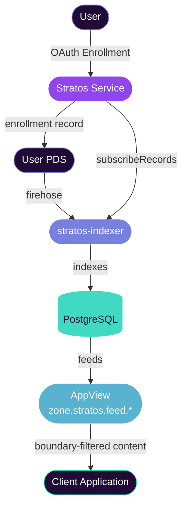

# Overview

Stratos is a **private namespace service** for ATProtocol that enables users to store content visible only within specific community domains. Unlike public `app.bsky` records that are globally visible, Stratos records have **domain boundaries** that restrict visibility.

## Key Concepts

| Concept              | Description |
|----------------------|-------------|
| **Domain Boundary**  | A service-qualified boundary identifier in `{serviceDid}/{name}` format. Records are visible only to enrolled users who share that boundary. |
| **Enrollment**       | The process of a user registering with a Stratos service via OAuth. |
| **Service DID**      | The decentralized identifier for the Stratos service itself. |
| **subscribeRecords** | WebSocket subscription that AppViews use to index Stratos content. |

## Use Cases

- **Community-private feeds** — Fandom and community social feeds.
- **Gated communities** — Content visible only to verified domain members.
- **Multi-community platforms** — Apps with per-community data isolation.

## Service Components

| Component         | Description |
|-------------------|-------------|
| `stratos-service` | XRPC/HTTP service — enrollment, record CRUD, sync export |
| `stratos-indexer` | Standalone indexer — PDS firehose + actor sync streams → PostgreSQL |
| AppView           | Feed query endpoints — `zone.stratos.feed.*` with boundary filtering |

## Request Flow

## Next Steps

- [Architecture](/operator/architecture) — system components, MST repos, storage layout
- [Deployment](/operator/deployment) — step-by-step production setup
- [Configuration](/operator/configuration) — all environment variables explained
