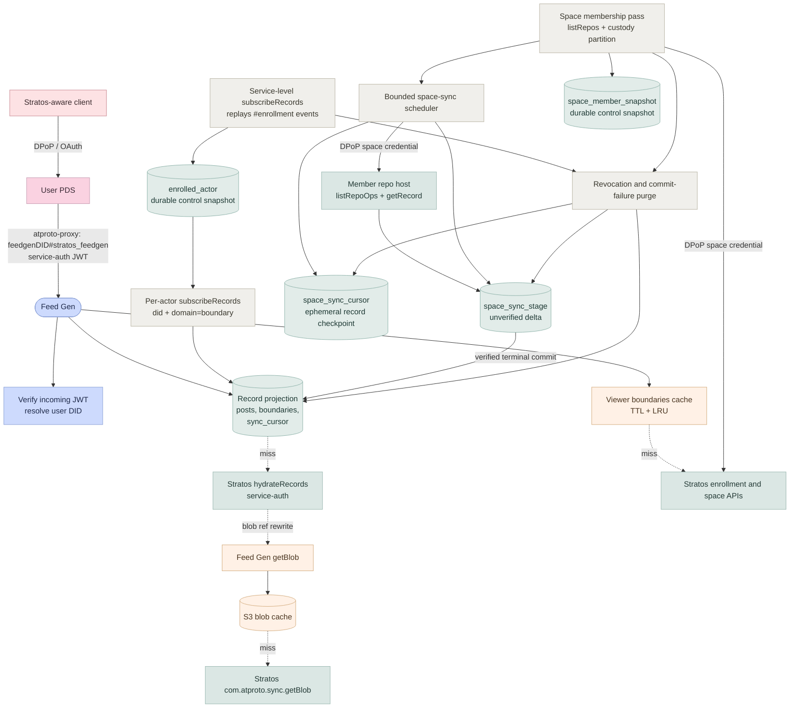

# @northskysocial/stratos-feedgen

Standalone feed generator for Stratos. It serves boundary-scoped, hydrated
feeds from a rebuildable local index fed by two custody-aware ingestion arms:
Stratos actor subscriptions and bounded polling of `pds`-custody member repos.

This works by relying on service auth via `atproto-proxy` as the JWT identifies the DID. This DID is then used to resolve the boundary membership and is used to serve the appropriate records in the feed.

## Architecture



**Background workers.** The Stratos-custody arm consumes service enrollment
events, maintains `enrolled_actor`, and starts or stops per-actor WebSocket
subscriptions. The PDS-custody arm enumerates each configured space with
`zone.stratos.space.listRepos`, polls only explicit `custody=pds` members, and
stages `listRepoOps`/`getRecord` deltas with a cursor per `(space, member)`.
Both arms share the purge path, so unenrollment, boundary loss, malformed
cursors, and invalid foreign commits clear derived state when detected. A
foreign-repo delta stays in `space_sync_stage` and is never served until the
host's terminal commit verifies. Verified promotion applies staged updates and
tombstones atomically to the index. A fresh run resets staged state only when
a terminal page awaits verification; capped pages retain their cursor.

For SQLite, the membership snapshots are held in a separate durable control
database and loaded into memory at startup. They are recovery and
reconciliation state, not authorization authority: replay admission checks the
current authority before allowing an actor's historical records, and an
unavailable or invalid answer fails closed so the replay can retry.

### Auth flow

| Direction                    | Mechanism                                                                                 | Verification                                                                   |
| ---------------------------- | ----------------------------------------------------------------------------------------- | ------------------------------------------------------------------------------ |
| Client → PDS                 | OAuth + DPoP                                                                              | PDS validates DPoP-bound token                                                 |
| PDS → Feed Gen               | Bearer service-auth JWT (`iss=userDID`, `aud=feedgenDID`, `lxm=<endpoint>`, `exp<60s`)    | Feed gen resolves user DID, verifies signature via atproto verification method |
| Feed Gen → Stratos           | Bearer service-auth JWT (`iss=feedgenDID`, `aud=stratosDID`, `lxm=<endpoint>`)            | Stratos `service` verifier resolves feed gen DID                               |
| Feed Gen → Stratos (sync WS) | `Authorization: Bearer` header = same JWT shape, `lxm=zone.stratos.sync.subscribeRecords` | Stratos `subscribeAuth` verifier                                               |
| Feed Gen → member repo host  | The same scoped credential plus a fresh DPoP presentation for each foreign-host request   | Member host verifies the space authority and request-bound DPoP proof          |

### Identity

- Feed gen DID: `did:web:<feedgen-host>`.
- DID document publishes an `#atproto` verification method (the feed gen's signing keypair) and a service entry with `id=#stratos_feedgen`, `type=NorthskyStratosFeedGen`, `serviceEndpoint=<https URL>`.
- The same signing key is used to mint outgoing service-auth JWTs to Stratos and to prove the feed gen's identity to callers.

### Storage choices

| Concern                                    | Choice                                                                                              |
| ------------------------------------------ | --------------------------------------------------------------------------------------------------- |
| Materialized record projection and cursors | `post`, `post_boundary`, `sync_cursor`, and `space_sync_cursor`; in-memory SQLite by default        |
| Unverified foreign-repo delta              | `space_sync_stage`; held until terminal verification and isolated from a fresh pending-terminal run |
| Durable membership/control snapshots       | `enrolled_actor` and `space_member_snapshot`; separate SQLite control DB, or Postgres storage       |
| Replay authorization                       | Current authoritative membership check; snapshots are never permission grants                       |
| Space credentials and DPoP keys            | In process; refreshed before expiry, never persisted                                                |
| Blob cache                                 | S3 or filestore                                                                                     |
| Feed configuration                         | Static — JSON/YAML file or env var                                                                  |
| Viewer boundary cache                      | In-process TTL + LRU (300 s default)                                                                |

### Moderation labels

Not yet implemented. The planned design (labeler subscription via a
`FEEDGEN_LABELERS` env var, a local `label` table, label merging on
`postView.labels` honoring `atproto-accept-labelers`) is recorded here as
intent only — the current feedgen neither fetches nor serves labels.

## Lexicons

| Lexicon                             | Type                    | Purpose                                                       |
| ----------------------------------- | ----------------------- | ------------------------------------------------------------- |
| `zone.stratos.feedgen.getFeed`      | query (authenticated)   | Returns fully-hydrated boundary-scoped posts                  |
| `zone.stratos.feedgen.describeFeed` | query (unauthenticated) | Returns configured feed list for operator/debug introspection |

Definitions live in [`stratos/lexicons/zone/stratos/feedgen/`](../lexicons/zone/stratos/feedgen/).

## Package layout

```
src/
  api/                   Feed, blob, health, metrics, and DID-document handlers
  db/                    SQLite/Postgres store, schemas, and cursor operations
  purge/                 Idempotent actor, boundary, and space-state deletion
  space-credential/      Delegation, DPoP, credential minting, and refresh
  space-sync/            Membership, hardened host client, poller, verification,
                         scheduler, and in-process authorization fencing
  subscription/          Service stream and Stratos-custody actor subscriptions
  upstream/              Typed RPC client for the authority Stratos service
  lifecycle/             Ordered startup/shutdown and panic handling
  config.ts              Env-driven configuration and bounded defaults
  index.ts               Public package exports
tests/
  space-sync-*.test.ts   Foreign-host, membership, cursor, and scheduler coverage
  db/                    Shared SQLite/Postgres store contract
```

**Naming note.** The module is called `upstream` and the class `UpstreamStratosClient` to avoid colliding with the public [`@northskysocial/stratos-client`](../stratos-client/) package.

## Configuration

| Env var                                       | Required    | Description                                                                     |
| --------------------------------------------- | ----------- | ------------------------------------------------------------------------------- |
| `FEEDGEN_SERVICE_DID`                         | yes         | Feed generator service DID                                                      |
| `FEEDGEN_PUBLIC_URL`                          | no          | Public base URL; derived from a `did:web` service DID when omitted              |
| `FEEDGEN_SIGNING_KEY`                         | yes         | Private secp256k1 service-signing key                                           |
| `STRATOS_SERVICE_URL`                         | yes         | Request base URL of the authority Stratos service                               |
| `STRATOS_PUBLIC_URL`                          | no          | Public Stratos origin used in DPoP `htu`; defaults to `STRATOS_SERVICE_URL`     |
| `STRATOS_SERVICE_DID`                         | yes         | DID of the authority Stratos service                                            |
| `FEEDGEN_PLC_URL`                             | no          | PLC directory used for commit-key resolution (default `https://plc.directory`)  |
| `FEEDGEN_STORAGE_BACKEND`                     | no          | `sqlite` (default) or `postgres`                                                |
| `FEEDGEN_SQLITE_PATH`                         | no          | Record projection SQLite location; unset or empty uses `:memory:`               |
| `FEEDGEN_MEMBERSHIP_SQLITE_PATH`              | conditional | Durable SQLite control DB; required for `:memory:`, else a sibling file         |
| `FEEDGEN_POSTGRES_URL`                        | conditional | Required for the Postgres backend                                               |
| `FEEDGEN_POSTGRES_SCHEMA`                     | no          | Postgres schema (default `public`)                                              |
| `FEEDGEN_SUBSCRIBE_ENROLLMENTS`               | no          | Set `false` to disable enrollment reconciliation; feed reads remain unavailable |
| `FEEDGEN_SPACE_SYNC_ENABLED`                  | no          | Enable the PDS-custody polling arm (default `true`)                             |
| `FEEDGEN_SPACE_SYNC_INTERVAL_MS`              | no          | Target interval between jittered passes (default `30000`)                       |
| `FEEDGEN_SPACE_MEMBERSHIP_PAGE_LIMIT`         | no          | Members requested per authority page, `1..1000` (default `100`)                 |
| `FEEDGEN_SPACE_MEMBERSHIP_REQUEST_TIMEOUT_MS` | no          | Timeout for membership listing and credential mint requests (default `60000`)   |
| `FEEDGEN_SPACE_SYNC_PAGE_LIMIT`               | no          | Ops requested per page, `1..1000` (default `1000`)                              |
| `FEEDGEN_SPACE_SYNC_MAX_PAGES`                | no          | Pages per member per pass (default `10`)                                        |
| `FEEDGEN_SPACE_SYNC_REQUEST_TIMEOUT_MS`       | no          | Timeout for one foreign-host request (default `10000`)                          |
| `FEEDGEN_SPACE_SYNC_MEMBER_BUDGET_MS`         | no          | Whole-member time budget per pass (default `60000`)                             |
| `FEEDGEN_SPACE_SYNC_MEMBER_CONCURRENCY`       | no          | Concurrent member syncs (default `8`)                                           |
| `FEEDGEN_SPACE_SYNC_MAX_RECORD_BYTES`         | no          | Maximum decoded record size (default `65536`)                                   |
| `FEEDGEN_SPACE_SYNC_MAX_RECORDS_PER_MEMBER`   | no          | Indexed-record cap per member and pass (default `1000`)                         |
| `FEEDGEN_SPACE_SYNC_ALLOW_HTTP_HOSTS`         | no          | Loopback `http://` only: `localhost`, `127/8`, `[::1]`; HTTPS always allowed    |
| `FEEDGEN_LOG_LEVEL`                           | no          | Pino level (default `info`)                                                     |

### Storage durability

SQLite separates the materialized record projection from durable membership/control state.
`FEEDGEN_SQLITE_PATH` holds posts, post boundaries, `sync_cursor`, `space_sync_cursor`,
`space_sync_stage`, and its pending-verification marker. It defaults to `:memory:`, so those
records and cursors are discarded on restart and rebuilt through the custody-aware subscription
and space-poller ingestion arms.

`FEEDGEN_MEMBERSHIP_SQLITE_PATH` holds only `enrolled_actor` and
`space_member_snapshot`. When the record projection is in memory, this must be an explicit
non-memory file path. Runtime membership components source their hot maps from those
snapshots for fast lookup and use them as a recovery/reconciliation baseline; they are not
permission grants.
Actor-subscription replay admission confirms current membership with the authority before
accepting an actor's historical records. If the authority lookup is unavailable or invalid,
the replay fails closed and retries rather than advancing its actor cursor.

The Compose overlay mounts `/app/data` as `feedgen-control` and configures
`/app/data/feedgen-membership.sqlite` for this purpose. The snapshot database still
contains sensitive DIDs and boundary membership, so protect it appropriately, but it does
not retain private records or replay cursors by default. The overlay also sets the core-dump
limit to zero because process memory can contain private content.

To retain the private record projection, set `FEEDGEN_SQLITE_PATH` to an explicit file path
on durable storage. When it is a file and `FEEDGEN_MEMBERSHIP_SQLITE_PATH` is omitted,
Feedgen derives a separate sibling membership database. Protect both files as private
content.

Selecting `FEEDGEN_STORAGE_BACKEND=postgres` and setting `FEEDGEN_POSTGRES_URL` persists
the projection, cursors, and membership snapshots together. Treat that database as private
content too.

### Feed-read readiness

Feed reads start fail closed. From process start, and again throughout every enrollment-stream
reconnect and reconciliation, `zone.stratos.feedgen.getFeed` returns HTTP `503` with the
XRPC error `FeedNotReady`. Reads become available only after a complete reconciliation against
the current authority. A pass bounded by `FEEDGEN_RECONCILE_MAX_ACTORS` is deliberately
partial and does not release the read gate.

Keep `FEEDGEN_SUBSCRIBE_ENROLLMENTS` enabled for any serving deployment. Setting it to
`false` leaves feed reads unavailable, so it is not a static-feed or manual-soak serving
mode.

## Observability

### Logging

Structured JSON logs via pino. Every request logs one completion line with
`requestId`, `viewerDid` (when authenticated), `endpoint`, `status`, and
`durationMs`. An inbound `X-Request-Id` header (sanitized, max 64 chars) is
honored and echoed on the response; otherwise a UUID is generated. `/health`
requests are counted in metrics but not logged.

### Telemetry

Feedgen emits bounded OpenTelemetry metrics by OTLP/HTTP only when
`OTEL_EXPORTER_OTLP_METRICS_ENDPOINT` is configured. The local listener does
not expose `/metrics`; scrape the Collector's private Prometheus endpoint
instead. Sentry reporting is independently enabled by `SENTRY_DSN`.

### `/health`

Returns `{ok, version, serviceStreamConnected, actorPoolSize}`. `ok` is
independent of subscription state: with `FEEDGEN_SUBSCRIBE_ENROLLMENTS=false`
the stream fields read `false`/`0` by design. `/health` is a liveness signal,
not a feed-readiness signal: `getFeed` remains HTTP `503` `FeedNotReady` until
the complete current-authority reconciliation releases its read gate.

### Shutdown semantics

On SIGTERM/SIGINT the feedgen stops accepting connections and drains in-flight
HTTP requests (15 s deadline, then open sockets are destroyed), waits for
startup, stops the service stream, and drains the space scheduler. If the
scheduler misses the deadline, shutdown aborts its active pass and still waits
for every raw member call that can access the store. It then drains actor
commit applies, closes the DB, and exits 0. Cursor writes are completed or
restored before the store closes. A file-backed record store or Postgres retains
committed cursors; the default in-memory record projection rebuilds them through
replay on the next boot. The separate membership/control SQLite database holds
no record cursors. A second signal exits 1 immediately.
`unhandledRejection`/`uncaughtException` log the error and exit 1.

### Manual soak test

Run locally with SQLite, seeded posts, and enrollment subscription enabled (the default).
Wait for the complete current-authority reconciliation to release feed reads, then drive
~50 req/s for 5 minutes against `getFeed` with a static service JWT, e.g.
`autocannon -R 50 -d 300 -H "authorization=Bearer $JWT" "$BASE/xrpc/zone.stratos.feedgen.getFeed?feed=<id>"`.
Record before/after RSS (`ps -o rss= -p <pid>`) and FD count
(`ls /proc/<pid>/fd | wc -l`) and Collector process metrics. Pass: RSS growth
< 50 MB and no FD growth.

## Build & test

From the package directory or via the workspace:

```sh
# build
pnpm --filter @northskysocial/stratos-feedgen build

# unit tests (vitest)
pnpm --filter @northskysocial/stratos-feedgen test
```

### Testing conventions

| Class       | Runner | Location                                                                                        |
| ----------- | ------ | ----------------------------------------------------------------------------------------------- |
| Unit        | vitest | `tests/**/*.test.ts` (in-process, fully mocked, no network)                                     |
| Integration | vitest | `tests/**/*.integration.test.ts` (in-process with real SQLite / in-memory HTTP)                 |
| Smoke / E2E | Deno   | [`stratos/test/scripts/feedgen-*.ts`](../test/scripts/) (phases of the existing Deno E2E suite) |

Cross-service smoke and E2E live under `stratos/test/scripts/` and reuse the helpers in `stratos/test/scripts/lib/`. The feed gen does **not** carry per-package smoke scripts or `test/e2e/` directories. Manual staging runs use the same Deno scripts with `STRATOS_SERVICE_URL` (and friends) overridden — there is no separate "manual smoke" artifact.
