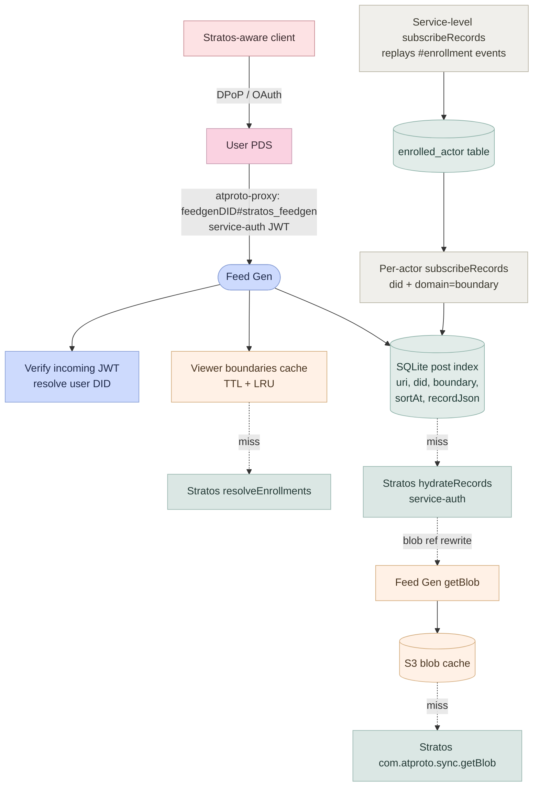

# @northskysocial/stratos-feedgen

Standalone feed generator for stratos. Serves boundary-scoped, hydrated feeds to stratos enabled clients by subscribing to a single Stratos service and caching posts + blobs locally.

This works by relying on service auth via `atproto-proxy` as the JWT identifies the DID. This DID is then used to resolve the boundary membership and is used to serve the appropriate records in the feed.

## Architecture



**Background workers.** A service-level `subscribeRecords` stream (no `did`) replays `#enrollment` events and upserts an `enrolled_actor` table, starting and stopping per-actor WebSocket subscriptions. Per-actor `subscribeRecords` streams (with `did` and `domain=<boundary>`) decode commits and upsert post + post_boundary rows.

### Auth flow

| Direction                    | Mechanism                                                                              | Verification                                                                   |
| ---------------------------- | -------------------------------------------------------------------------------------- | ------------------------------------------------------------------------------ |
| Client → PDS                 | OAuth + DPoP                                                                           | PDS validates DPoP-bound token                                                 |
| PDS → Feed Gen               | Bearer service-auth JWT (`iss=userDID`, `aud=feedgenDID`, `lxm=<endpoint>`, `exp<60s`) | Feed gen resolves user DID, verifies signature via atproto verification method |
| Feed Gen → Stratos           | Bearer service-auth JWT (`iss=feedgenDID`, `aud=stratosDID`, `lxm=<endpoint>`)         | Stratos `service` verifier resolves feed gen DID                               |
| Feed Gen → Stratos (sync WS) | `Authorization: Bearer` header = same JWT shape, `lxm=zone.stratos.sync.subscribeRecords` | Stratos `subscribeAuth` verifier                                               |

### Identity

- Feed gen DID: `did:web:<feedgen-host>`.
- DID document publishes an `#atproto` verification method (the feed gen's signing keypair) and a service entry with `id=#stratos_feedgen`, `type=NorthskyStratosFeedGen`, `serviceEndpoint=<https URL>`.
- The same signing key is used to mint outgoing service-auth JWTs to Stratos and to prove the feed gen's identity to callers.

### Storage choices

| Concern                        | Choice                               |
| ------------------------------ | ------------------------------------ |
| Post / boundary / cursor index | SQLite (WAL) via Drizzle             |
| Blob cache                     | S3 or filestore                      |
| Feed configuration             | Static — JSON/YAML file or env var   |
| Viewer boundary cache          | In-process TTL + LRU (300 s default) |

### Moderation labels

The feed gen can subscribe to one or more labeler DIDs (`FEEDGEN_LABELERS`), caches labels in a local `label` table, and attaches them to `postView.labels` at serialization time — merging self-labels (extracted from `recordJson`) with external labels filtered by the `atproto-accept-labelers` request header. The response carries an `atproto-content-labelers` header listing the labelers actually consulted.

Clients are responsible for acting on labels (blur, hide, warn) using `labelValueDefinition` metadata fetched separately. The feed gen never filters posts based on labels — it only annotates.

## Lexicons

| Lexicon                             | Type                    | Purpose                                                       |
| ----------------------------------- | ----------------------- | ------------------------------------------------------------- |
| `zone.stratos.feedgen.getFeed`      | query (authenticated)   | Returns fully-hydrated boundary-scoped posts                  |
| `zone.stratos.feedgen.describeFeed` | query (unauthenticated) | Returns configured feed list for operator/debug introspection |

Definitions live in [`stratos/lexicons/zone/stratos/feedgen/`](../lexicons/zone/stratos/feedgen/).

## Package layout

```
src/
  config.ts              Env-driven config loader
  upstream/              Typed RPC client for the single upstream Stratos
    client.ts            UpstreamStratosClient (resolveEnrollments,
                         hydrateRecords, getBlob, mintServiceAuthToken)
    jwt.ts               mintServiceJwt — per-call 60 s service-auth JWTs
    errors.ts            StratosClientError (status, body, url, lxm)
    index.ts             Barrel
  index.ts               Public package exports
tests/
  upstream.test.ts       Unit tests for the upstream client
```

**Naming note.** The module is called `upstream` and the class `UpstreamStratosClient` to avoid colliding with the public [`@northskysocial/stratos-client`](../stratos-client/) package.

## Configuration

| Env var               | Required | Description                                                                    |
| --------------------- | -------- | ------------------------------------------------------------------------------ |
| `FEEDGEN_SERVICE_DID` | yes      | This feed generator's service DID (e.g. `did:web:feedgen.example.com`)         |
| `FEEDGEN_SIGNING_KEY` | yes      | Private signing key for this feed generator's service identity (hex secp256k1) |
| `STRATOS_SERVICE_URL` | yes      | Base URL of the upstream Stratos service                                       |
| `STRATOS_SERVICE_DID` | yes      | DID of the upstream Stratos service                                            |

Additional configuration (DB path, port, S3 cache settings, feed definitions, labeler DIDs) is added as the corresponding subsystems land.

## Build & test

From the package directory or via the workspace:

```sh
# build
pnpm --filter @northskysocial/stratos-feedgen build

# unit tests (vitest)
pnpm --filter @northskysocial/stratos-feedgen test
```

### Testing conventions

| Class       | Runner | Location                                                                                        |
| ----------- | ------ | ----------------------------------------------------------------------------------------------- |
| Unit        | vitest | `tests/**/*.test.ts` (in-process, fully mocked, no network)                                     |
| Integration | vitest | `tests/**/*.integration.test.ts` (in-process with real SQLite / in-memory HTTP)                 |
| Smoke / E2E | Deno   | [`stratos/test/scripts/feedgen-*.ts`](../test/scripts/) (phases of the existing Deno E2E suite) |

Cross-service smoke and E2E live under `stratos/test/scripts/` and reuse the helpers in `stratos/test/scripts/lib/`. The feed gen does **not** carry per-package smoke scripts or `test/e2e/` directories. Manual staging runs use the same Deno scripts with `STRATOS_SERVICE_URL` (and friends) overridden — there is no separate "manual smoke" artifact.
